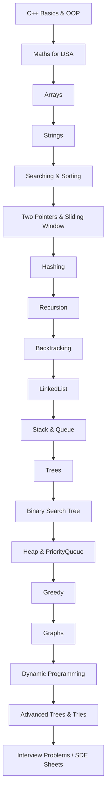

# 🚀 C++ DSA Mastery — FAANG & Competitive Programming

<div align="center">
  
  
  
  
</div>

---

# 🔥 Why this repository?

### ✔️ Structured C++ DSA learning path

### ✔️ Problem-solving roadmap (Love Babbar, Striver, CoderArmy)

### ✔️ Topic-wise notes, patterns, and clean examples

### ✔️ Clean folder READMEs & templates

### ✔️ Professional, GitHub-friendly design

---

# 📂 Folder Structure (`learn-dsa-cpp/`)

```
📦 learn-dsa-cpp
├── 00-utils/             # helper functions, macros, print/debug templates
├── 01-arrays/
│   ├── 1d/
│   │   ├── 00-basics/
│   │   ├── 01-easy/
│   │   ├── 02-medium/
│   │   └── 03-advanced/
│   ├── 2d/
│   └── problems/
├── 02-strings/
├── 03-linked-list/
├── 04-stack/
├── 05-queue/
├── 06-binary-search/
├── 07-sorting/
│   ├── basic/
│   └── advanced/
├── 08-recursion/
├── 09-hashing/
├── 10-trees/
├── 11-bst/
├── 12-heap/
├── 13-graphs/
├── 14-greedy/
├── 15-backtracking/
└── 16-dp/
```

---

### 🔵 Core Topics


### 🟣 Data Structures


### 🟠 Algorithms


### 🟤 C++ Essentials


---

# 🧭 DSA Roadmap (Mermaid Diagram)



---

# 📐 Coding Standards (C++)

* **File per problem** → clean, modular
* Use **meaningful variable names** (`left`, `right`, `freq`, `visited`)
* Add **Time & Space Complexity** at the top of each file
* Prefer `#include <bits/stdc++.h>` for contests
* Use **STL** (`vector`, `map`, `set`, `pair`) wherever possible
* Use **clang-format** or VS Code formatting for clean code
* Pass **array sizes explicitly** (`int arr[], int n`)
* Keep functions small & reusable

---

# 🧠 Study Strategy

1. Watch Love Babbar / Striver video
2. Dry run examples on paper
3. Type **clean C++ code** yourself
4. Test **edge cases**
5. Solve **5–10 problems per topic**
6. Only move to the next topic after **mastery**

> ⚡ Quality > Speed

---

# 🌟 Goals

* Build **strong logic & problem-solving skills**
* Prepare for **coding interviews & contests**
* Track progress **topic-wise**
* Maintain **professional GitHub repo**

---

# 📌 Notes / Tips

* Start with **arrays**, then **strings → linked list → stack → queue**
* Learn **STL** before contests for faster solutions
* Always **dry run your code**
* Update README badges to track solved problems

---

# 🔗 References

* Love Babbar DSA Playlist: [YouTube](https://www.youtube.com/channel/UCQHLxxBFrbfdrk1jF0moTpw)
* C++ STL Documentation: [cppreference.com](https://en.cppreference.com/w/cpp/container)
* Competitive Programming Tips: [Codeforces](https://codeforces.com/)

---

# 📜 License

Licensed under **Apache 2.0**

---
